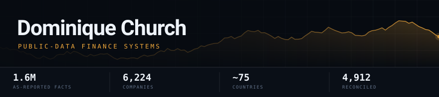

<!-- Pixel art agent: commit the image to this repo as assets/agent-pixel.png (or push it to
     DOMCHURCH/Gnosis under docs/ and swap in the raw.githubusercontent URL), then uncomment: -->
<!--  -->

---

### Live in production

I build self-contained data systems: scheduled ingestion from free public sources (SEC EDGAR, GDELT, World Bank, FRED, OFAC), typed storage, a scoring or valuation model on top, and a UI that shows the result at full resolution. Everything below is deployed and running on real data — no mocks, no paywalled feeds.

Current flagship: BalanceProof — reconciled SEC balance sheet data, live at [balanceproof.dev](https://balanceproof.dev).

#### 🤖 [Gnosis](https://github.com/DOMCHURCH/Gnosis) — terminal coding agent
Open-source terminal coding agent (TypeScript + Ink) with a browser UI (`dom serve`) and a live Three.js 3D office floor where sub-agents animate between zones as they work. Provider-agnostic via OpenRouter — switch models mid-session with the conversation intact, automatic fallback to the cheapest paid model on upstream errors. MCP client, Obsidian-backed long-term memory, local Kokoro TTS voice overlay, Electron desktop build with notify-only auto-updater, token-bucket rate limiting and host-allowlisted server with timing-safe auth. **150+ verify suites** run on every CI push (Windows + Playwright). MIT.

#### 🌍 [Sovereign](https://sovereign-production-0351.up.railway.app) — geopolitical risk intelligence
Continuously ingests public data across ~75 countries, fuses it into a typed `Country` ontology in DuckDB, and runs a NetworkX contagion model over the resulting graph. Outputs a composite **0–100 risk score** per country, a history/delta series, and cross-border spillover alerts weighted by financial correlation, trade openness and regional adjacency. A **GDELT bulk-event ingestor** parses the 15-minute export files, filters to violent CAMEO codes, deduplicates and cross-corroborates sources, and renders ~700 geolocated incidents/day onto a WebGL globe (NASA Blue Marble textures, real sun position) with click-through to the source article. Connectors are free and keyless: World Bank WDI/WGI, FRED, OFAC SDN, country-proxy ETFs, VADER-scored news from 11 outlets, GDELT, Open-Meteo. APScheduler drives a 15-minute fast cycle and a 6-hour full cycle on a Railway persistent volume; an LLM analyst chat sits over the same store.

#### 📈 [Axiom](https://axiom-mu-ten.vercel.app) — institutional-style equity research
Ticker in, fully priced research note out. Resolves the ticker to a CIK against SEC's company_tickers file, pulls five years of XBRL company facts from `data.sec.gov`, derives margins and Piotroski F-score inputs, runs an LLM analysis pass, and renders a complete note — **DCF, comparables, bull/bear thesis, risk score, recommendation** — exportable to PDF. Handles the 60s/30s function caps with retry and backoff.

#### ⚖️ [BalanceProof](https://balanceproof.dev) — reconciled balance sheets at true proportion
Every US public company's balance sheet, drawn at real scale from SEC filings. A bank, a retailer and a software company produce visibly different shapes. Three views per company: what it owns and who has a claim on it, where each dollar of revenue goes, and how its annual sales compare to national GDP.

The hard part was selection: SEC reports the same figure many times per filing, split by segment, geography and legal entity. JPMorgan files "total assets" 23 separate times, and exactly one row is the consolidated company. Every filing is reconciled against the accounting identity (Assets = Liabilities + Equity) before it is stored. 6,224 companies covered. 4,912 reconcile directly. 215 flagged with a specific reason. 0 hidden.

Live: https://balanceproof.dev

API: https://balanceproof.dev/api

Repo: https://github.com/DOMCHURCH/AlphaCode

---

### Stack

---

<table>
<tr>
<td align="center" valign="middle">

</td>
<td align="center" valign="middle">
<picture>
  <source media="(prefers-color-scheme: dark)" srcset="https://raw.githubusercontent.com/DOMCHURCH/DOMCHURCH/output/github-snake-dark.svg" />
  <source media="(prefers-color-scheme: light)" srcset="https://raw.githubusercontent.com/DOMCHURCH/DOMCHURCH/output/github-snake.svg" />
  
</picture>
</td>
</tr>
</table>

---

Ottawa · Public data, real systems · 2026 · balanceproof.dev

